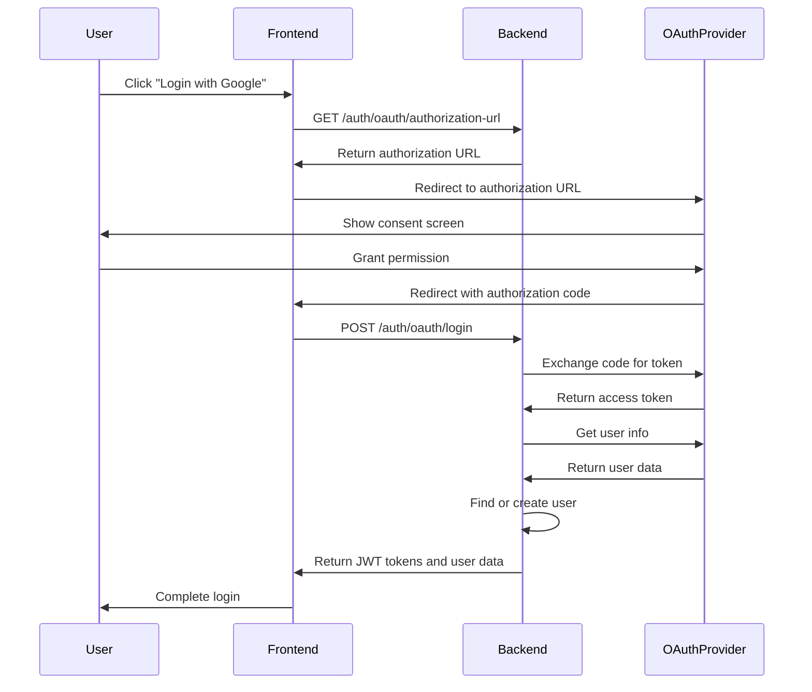
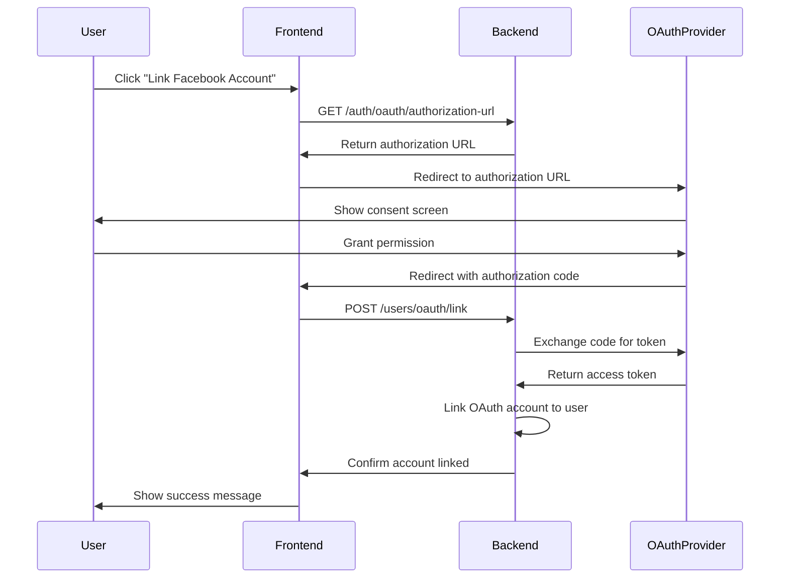

# OAuth 2.0 Implementation Guide

## Overview

The Event Management Platform implements a comprehensive OAuth 2.0 authentication system that supports multiple social identity providers and provides both user authentication and account linking capabilities.

## Supported OAuth Providers

### 1. Google OAuth 2.0
- **Provider**: Google
- **Scopes**: `openid email profile`
- **User Info Endpoint**: `https://www.googleapis.com/oauth2/v2/userinfo`
- **Features**: Email verification, profile picture, name information

### 2. Facebook OAuth 2.0
- **Provider**: Facebook
- **Scopes**: `email public_profile`
- **User Info Endpoint**: `https://graph.facebook.com/me`
- **Features**: Profile picture, name information

### 3. Apple Sign-In
- **Provider**: Apple
- **Scopes**: `name email`
- **User Info Endpoint**: `https://appleid.apple.com/auth/userinfo`
- **Features**: Email verification, name information

### 4. Microsoft OAuth 2.0
- **Provider**: Microsoft
- **Scopes**: `openid email profile`
- **User Info Endpoint**: `https://graph.microsoft.com/v1.0/me`
- **Features**: Email verification, profile information

### 5. GitHub OAuth 2.0
- **Provider**: GitHub
- **Scopes**: `read:user user:email`
- **User Info Endpoint**: `https://api.github.com/user`
- **Features**: Email verification, profile information

## Architecture

### Components

1. **OAuthService** (`src/domains/users/services/OAuthService.ts`)
   - Handles OAuth provider interactions
   - Manages token exchange and user info retrieval
   - Implements user creation and account linking

2. **OAuth Handlers** (`src/domains/users/handlers/oauthHandlers.ts`)
   - Lambda functions for OAuth operations
   - API endpoints for OAuth flows

3. **Cognito Integration**
   - AWS Cognito User Pool with OAuth identity providers
   - Built-in OAuth flows and token management

4. **DynamoDB Storage**
   - OAuth account linking information
   - User profile data from OAuth providers

## API Endpoints

### OAuth Authentication

#### 1. Get OAuth Authorization URL
```http
GET /auth/oauth/authorization-url?provider={provider}&redirectUri={redirectUri}&state={state}
```

**Parameters:**
- `provider`: OAuth provider (google, facebook, apple, microsoft, github)
- `redirectUri`: Callback URL for OAuth flow
- `state`: Optional state parameter for security

**Response:**
```json
{
  "success": true,
  "data": {
    "authorizationUrl": "https://accounts.google.com/o/oauth2/v2/auth?...",
    "provider": "google",
    "redirectUri": "https://yourapp.com/callback"
  }
}
```

#### 2. OAuth Login
```http
POST /auth/oauth/login
```

**Request Body:**
```json
{
  "provider": "google",
  "authorizationCode": "4/0AfJohXn...",
  "redirectUri": "https://yourapp.com/callback"
}
```

**Response:**
```json
{
  "success": true,
  "data": {
    "message": "Login successful",
    "user": {
      "id": "user-123",
      "email": "user@example.com",
      "username": "user1234",
      "firstName": "John",
      "lastName": "Doe",
      "profilePictureUrl": "https://...",
      "role": "attendee",
      "status": "active",
      "emailVerified": true,
      "phoneVerified": false,
      "createdAt": "2024-01-01T00:00:00Z"
    },
    "accessToken": "eyJhbGciOiJIUzI1NiIs...",
    "refreshToken": "eyJhbGciOiJIUzI1NiIs...",
    "expiresIn": 3600,
    "isNewUser": false
  }
}
```

### OAuth Account Management

#### 3. Link OAuth Account
```http
POST /users/oauth/link
Authorization: Bearer {jwt_token}
```

**Request Body:**
```json
{
  "provider": "facebook",
  "authorizationCode": "4/0AfJohXn...",
  "redirectUri": "https://yourapp.com/callback"
}
```

#### 4. Unlink OAuth Account
```http
POST /users/oauth/unlink
Authorization: Bearer {jwt_token}
```

**Request Body:**
```json
{
  "provider": "facebook"
}
```

#### 5. Get Linked OAuth Accounts
```http
GET /users/oauth/accounts
Authorization: Bearer {jwt_token}
```

**Response:**
```json
{
  "success": true,
  "data": {
    "linkedAccounts": [
      {
        "provider": "google",
        "providerUserId": "123456789",
        "linkedAt": "2024-01-01T00:00:00Z"
      },
      {
        "provider": "facebook",
        "providerUserId": "987654321",
        "linkedAt": "2024-01-02T00:00:00Z"
      }
    ]
  }
}
```

## OAuth Flow Implementation

### 1. Authorization Code Flow (Recommended)



### 2. Account Linking Flow



## Security Considerations

### 1. State Parameter
- Always include a `state` parameter in OAuth requests
- Validate the state parameter in callbacks
- Use cryptographically secure random values

### 2. Redirect URI Validation
- Strictly validate redirect URIs
- Use HTTPS in production
- Whitelist allowed redirect URIs

### 3. Token Security
- Store OAuth tokens securely
- Implement token refresh mechanisms
- Use short-lived access tokens

### 4. User Data Privacy
- Only request necessary scopes
- Implement data minimization
- Provide clear privacy notices

## Environment Configuration

### Required Environment Variables

```bash
# Google OAuth
GOOGLE_CLIENT_ID=your_google_client_id
GOOGLE_CLIENT_SECRET=your_google_client_secret

# Facebook OAuth
FACEBOOK_CLIENT_ID=your_facebook_client_id
FACEBOOK_CLIENT_SECRET=your_facebook_client_secret

# Apple Sign-In
APPLE_CLIENT_ID=your_apple_client_id
APPLE_CLIENT_SECRET=your_apple_client_secret

# Microsoft OAuth
MICROSOFT_CLIENT_ID=your_microsoft_client_id
MICROSOFT_CLIENT_SECRET=your_microsoft_client_secret

# GitHub OAuth
GITHUB_CLIENT_ID=your_github_client_id
GITHUB_CLIENT_SECRET=your_github_client_secret

# JWT Configuration
JWT_SECRET=your_jwt_secret_key
JWT_EXPIRES_IN=1h
REFRESH_TOKEN_EXPIRES_IN=7d
```

## Frontend Integration

### React Example

```typescript
import { useState } from 'react';

const OAuthLogin = () => {
  const [loading, setLoading] = useState(false);

  const handleOAuthLogin = async (provider: string) => {
    setLoading(true);
    try {
      // Get authorization URL
      const authUrlResponse = await fetch(
        `/auth/oauth/authorization-url?provider=${provider}&redirectUri=${encodeURIComponent(window.location.origin + '/oauth-callback')}`
      );
      const { data: { authorizationUrl } } = await authUrlResponse.json();

      // Redirect to OAuth provider
      window.location.href = authorizationUrl;
    } catch (error) {
      console.error('OAuth login failed:', error);
      setLoading(false);
    }
  };

  const handleOAuthCallback = async (authorizationCode: string, provider: string) => {
    try {
      const response = await fetch('/auth/oauth/login', {
        method: 'POST',
        headers: { 'Content-Type': 'application/json' },
        body: JSON.stringify({
          provider,
          authorizationCode,
          redirectUri: window.location.origin + '/oauth-callback'
        })
      });

      const { data } = await response.json();
      
      // Store tokens and user data
      localStorage.setItem('accessToken', data.accessToken);
      localStorage.setItem('refreshToken', data.refreshToken);
      localStorage.setItem('user', JSON.stringify(data.user));

      // Redirect to dashboard
      window.location.href = '/dashboard';
    } catch (error) {
      console.error('OAuth callback failed:', error);
    }
  };

  return (
    <div>
      <button 
        onClick={() => handleOAuthLogin('google')}
        disabled={loading}
      >
        {loading ? 'Loading...' : 'Login with Google'}
      </button>
      
      <button 
        onClick={() => handleOAuthLogin('facebook')}
        disabled={loading}
      >
        {loading ? 'Loading...' : 'Login with Facebook'}
      </button>
    </div>
  );
};
```

### OAuth Callback Handler

```typescript
// In your OAuth callback route
const OAuthCallback = () => {
  useEffect(() => {
    const urlParams = new URLSearchParams(window.location.search);
    const code = urlParams.get('code');
    const state = urlParams.get('state');
    const provider = urlParams.get('provider') || 'google';

    if (code) {
      handleOAuthCallback(code, provider);
    }
  }, []);

  return <div>Processing OAuth login...</div>;
};
```

## Testing OAuth Integration

### 1. Local Development
- Use localhost redirect URIs
- Set up OAuth apps for development
- Use test user accounts

### 2. Staging Environment
- Use staging domain redirect URIs
- Test with real OAuth providers
- Validate all OAuth flows

### 3. Production Deployment
- Use production domain redirect URIs
- Implement proper error handling
- Monitor OAuth success rates

## Monitoring and Analytics

### Key Metrics
- OAuth login success rate
- Account linking success rate
- OAuth provider usage distribution
- Error rates by provider

### CloudWatch Alarms
- OAuth Lambda function errors
- OAuth API endpoint response times
- Failed OAuth authentication attempts

## Best Practices

1. **User Experience**
   - Provide clear OAuth provider options
   - Show loading states during OAuth flows
   - Handle OAuth errors gracefully

2. **Security**
   - Implement CSRF protection
   - Validate all OAuth responses
   - Use secure token storage

3. **Performance**
   - Cache OAuth provider configurations
   - Implement token caching
   - Optimize user info retrieval

4. **Maintenance**
   - Monitor OAuth provider changes
   - Update OAuth scopes as needed
   - Regular security audits

## Troubleshooting

### Common Issues

1. **Invalid Redirect URI**
   - Check OAuth app configuration
   - Verify redirect URI encoding
   - Ensure HTTPS in production

2. **Authorization Code Expired**
   - Implement proper error handling
   - Retry OAuth flow
   - Check token exchange timing

3. **Missing User Information**
   - Verify OAuth scopes
   - Check provider API changes
   - Implement fallback data

4. **Account Linking Conflicts**
   - Check for existing OAuth accounts
   - Implement proper conflict resolution
   - Provide user guidance

## Future Enhancements

1. **Additional Providers**
   - LinkedIn OAuth
   - Twitter OAuth
   - Discord OAuth

2. **Advanced Features**
   - OAuth token refresh
   - Multi-provider account merging
   - OAuth account recovery

3. **Security Enhancements**
   - OAuth PKCE support
   - Advanced token validation
   - OAuth audit logging
